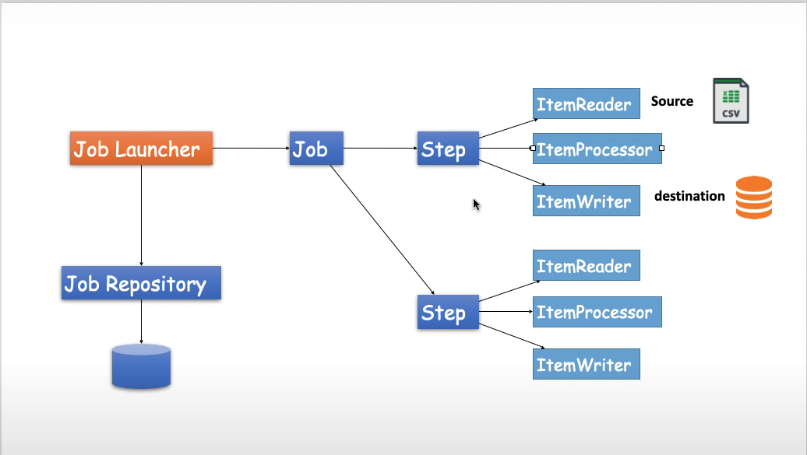

# spring-batch-example
### Dumping data from CSV file to MySQL Database using Spring Batch

The configuration class SpringBatchConfig of Spring Batch job that reads data from a CSV file, processes it using a CustomerProcessor, and writes it to a database using a RepositoryItemWriter.

